# Comprehensive ELT Sales Data Pipeline

<h1 align="center">
  <a
    target="_blank"
    href="https://mage.ai"
  >
    
  </a>
</h1>

## Overview
This project involves constructing an advanced sales data pipeline for a retail company, integrating sales data with user and weather information to facilitate comprehensive analysis of customer behavior and sales trends.

## Technology Stack
- **Python**: For scripting and automation of the pipeline.
- **[MageAI](https://docs.mage.ai/introduction/overview)**: For pipeline  orchestration, visualization and integrate and synchronize data from various sources.
- **[DBT (Data Build Tool)](https://www.getdbt.com/)**: For transforming data with SQL.
- **PostgreSQL**: As the relational database management system.

## Pipeline
- ### Pipeline Execution
    To run the pipeline, follow these steps:

    1. Clone the repository:
        ```
        git clone https://github.com/7AM7/sales-elt
        ```
    2. Navigate to the project directory:
        ```
        cd sales-elt
        ```
    3. Create a `.env` file in the project root directory with the following environment variables:
        ```
        POSTGRES_DB=postgres
        POSTGRES_USER=admin
        POSTGRES_PASSWORD=admin
        PG_HOST_PORT=5432
        POSTGRES_HOST=postgres-magic
        POSTGRES_SCHEMA=dbt_demo
        WEATHER_API_KEY={WEATHER_API_KEY}
        ```
        **NOTE**: To obtain your unique `WEATHER_API_KEY`, sign up or log in at [OpenWeatherMap](https://openweathermap.org/) and follow their instructions.

    4. Start the services using Docker:
        ```
        docker-compose up
        ```

    After running the Docker command, you will have access to the following:

    - **MageAI**: [http://localhost:6789/](http://localhost:6789/) - A web interface for managing, visualizing and transforming data.
    - **DBT Documentation**: [http://localhost:8001/](http://localhost:8001/) - Provides an overview of your DBT models, their lineage, and documentation.
    <br/>**Note**: You may need to refresh the page for DBT docs to load properly.

- ### Pipelines Workflow
  #### Sales ELT Pipeline
    - How to run the pipeline

      <h1 align="center">
        <a
          target="_blank"
        >
          
        </a>
      </h1>

    - The following diagram represents the ELT pipeline implemented in this project:
      <h1 align="center">
        <a
          target="_blank"
        >
          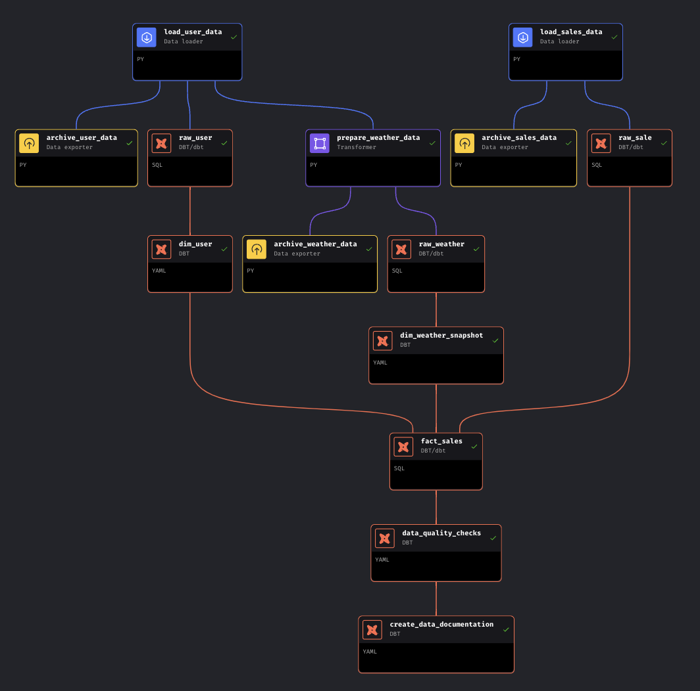
        </a>
      </h1>

      *Above image depicts the workflow of the ELT (Extract, Load, Transform) pipeline. It illustrates the processes from data extracting to loading and final transformation.*

  - **Data Extracting**:
      - Parallel extracting of sales (Local File) and user data (User API).
      - Retrieve weather information based on the user's geographical coordinates (latitude and longitude) through the specified weather data API endpoint.
      - Store the extracted data in the `archive/users`, `archive/sales`, and `archive/weather` directories, naming the files according to the pipeline execution timestamp in the format `year-month-day-hour.csv`.

  - **Data Loading**:
      - Load the data into three tables: `raw_user`, `raw_weather`, and `raw_sale`.
      - Initiate preliminary transformations by defining unique identifiers for sales and weather records to ensure data uniformity and integrity prior to the detailed transformation phase.

  - **Transformation**:
    - Data from `raw_user` is transformed and stored into `dim_user` with snapshot scehma to keep the user history.
    - Data from `raw_weather` is similarly transformed into `dim_weather`.
    - The transformation process include data cleaning and manipulation.
    - `fact_sales` is an incremental table created by joining `dim_user` and `dim_weather`. Only includes active records to reflect the most recent data and using the fact for reporting and visualizations.

  #### Sales Reporting and Visualizations Pipeline
    - How to run the pipeline

      <h1 align="center">
        <a
          target="_blank"
        >
          
        </a>
      </h1>
    - The Sales Reporting and Visualizations Pipeline is a sophisticated
     segment of our data system that utilizes DBT for executing a variety of aggregation queries on the `fact_sales` table. The purpose of this pipeline is to derive actionable business insights and facilitate data-driven decision-making. Below is a table detailing the business questions addressed, the visualizations used to present the data, and the insights or impacts derived from each analysis.
      <table width="100%" border="1">
        <thead>
          <tr>
            <th>Business Question</th>
            <th>Visualization Chart (Image)</th>
            <th>Business Answer/Insights/Impact</th>
          </tr>
        </thead>
        <tbody>
          <tr>
            <td>What are the total sales per customer?</td>
            <td>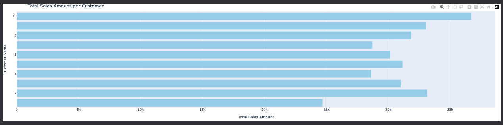</td>
            <td>Analysis of total sales per customer provides insights into customer value, helping to identify high-value customers and tailor marketing strategies to enhance customer loyalty and increase sales.</td>
          </tr>
          <tr>
            <td>What is the average order quantity per product?</td>
            <td>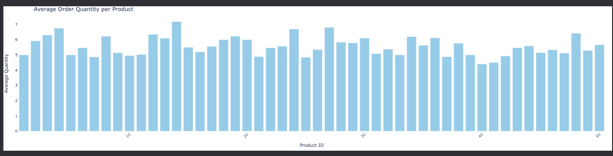</td>
            <td>Insights into the most and least popular products based on order quantity can inform inventory management and marketing strategies.</td>
          </tr>
          <tr>
            <td>How do sales vary with weather conditions?</td>
            <td>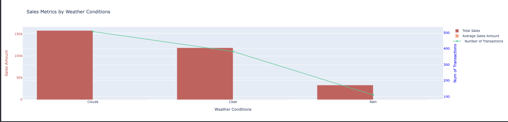</td>
            <td>Understanding the impact of weather on sales can guide promotions and stock adjustments.</td>
          </tr>
          <tr>
            <td>What is the product sales summary by city?</td>
            <td>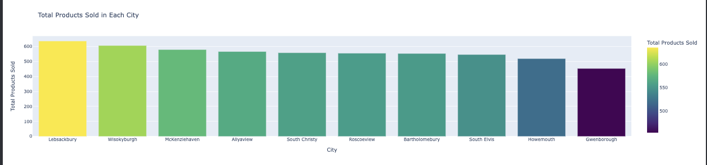</td>
            <td>Identifying which products sell best in which cities can inform regional sales strategies.</td>
          </tr>
          <tr>
            <td>How has customer spending changed over time?</td>
            <td>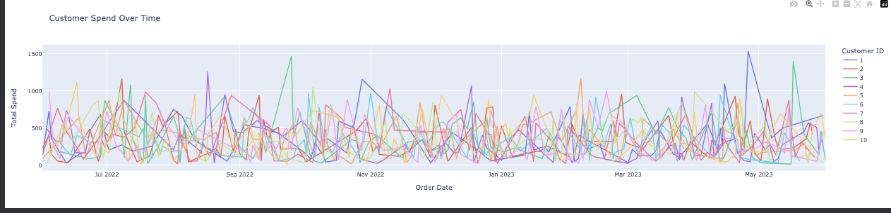</td>
            <td>Tracking spending trends over time can reveal customer loyalty and the effectiveness of long-term engagement efforts.</td>
          </tr>
          <tr>
            <td>Which products are likely to be reordered by customers?</td>
            <td>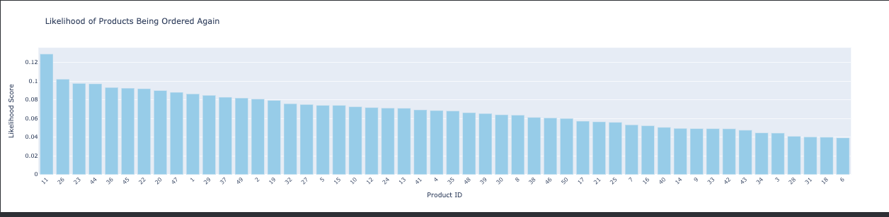</td>
            <td>Pinpointing products with high repeat purchase rates can influence stock ordering and product development.</td>
          </tr>
          <tr>
            <td>What are the monthly sales trends?</td>
            <td>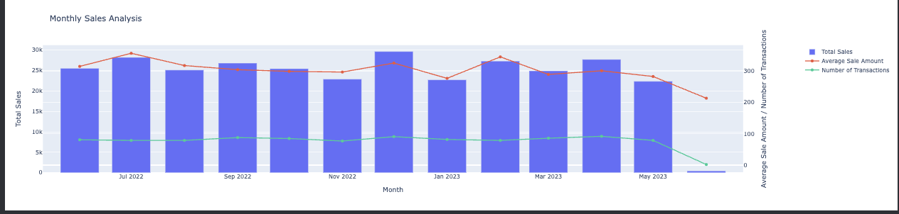</td>
            <td>Monthly sales trends provide insights into seasonal effects and can be used for forecasting.</td>
          </tr>
          <tr>
            <td>What are the quarterly sales trends?</td>
            <td>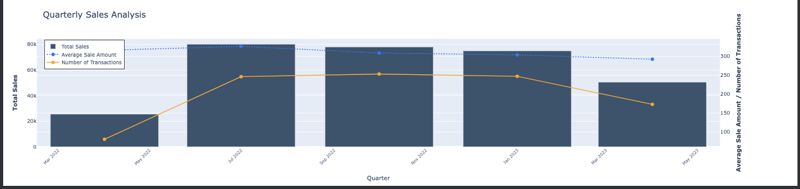</td>
            <td>Understanding quarterly trends helps in setting short-term goals and adjusting tactics accordingly.</td>
          </tr>
          <tr>
            <td>Who are the top-selling customers?</td>
            <td>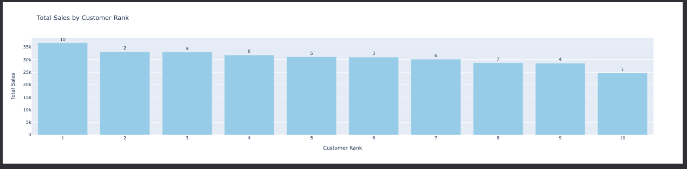</td>
            <td>Identifying top customers can help in customizing loyalty programs and targeting marketing campaigns.</td>
          </tr>
          <tr>
            <td>What are the top-selling products?</td>
            <td>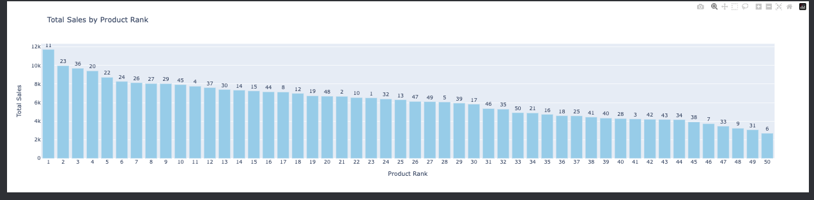</td>
            <td>Knowing the bestsellers can assist in inventory prioritization and highlight successful product features.</td>
          </tr>
          <tr>
            <td>How do weekly sales vary per customer?</td>
            <td>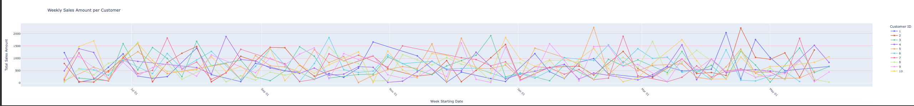</td>
            <td>Weekly sales data per customer can aid in personalizing sales approaches and optimizing contact times.</td>
          </tr>
        </tbody>
      </table>


## Database
  ### Database Schema

  In our data pipeline, we employ a star schema for organizing our data warehouse, which is particularly conducive to the Extract, Load, Transform (ELT) process. This approach begins with the extraction of data from various sources, which is then stored in raw tables designed to hold the unprocessed data. The raw tables in our schema include `raw_sale`, `raw_user`, and `raw_weather`, which capture the essential attributes required for sales transactions, user profiles, and weather conditions respectively.

  The star schema comes into play during the transformation step, where the raw data is processed and organized into dimension (`dim_`) and fact (`fact_`) tables. The dimension tables, `dim_user` and `dim_weather`, contain attributes that describe the entities involved in the sales process, while the `fact_sales` table captures the quantitative metrics of each sale, like quantity and price, as well as the keys linking to the dimension tables.

  The star schema is favored in data warehousing for its simple structure that centralizes fact tables with surrounding dimension tables, enhancing OLAP query efficiency and simplifying BI and analytics processes. Our use of the star schema ensures ease of complex query execution and adaptability for future growth.

  Below are the database schema diagrams that outline the structure of our raw and transformed tables:
  <h1 align="center">
    <a
      target="_blank"
    >
      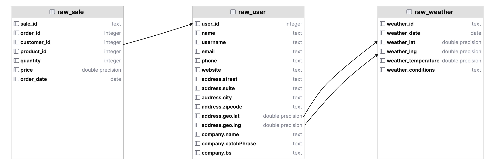
    </a>
  </h1>

*This diagram illustrates the raw tables including `raw_sale`, `raw_user`, and `raw_weather`.*

  <h1 align="center">
    <a
      target="_blank"
    >
      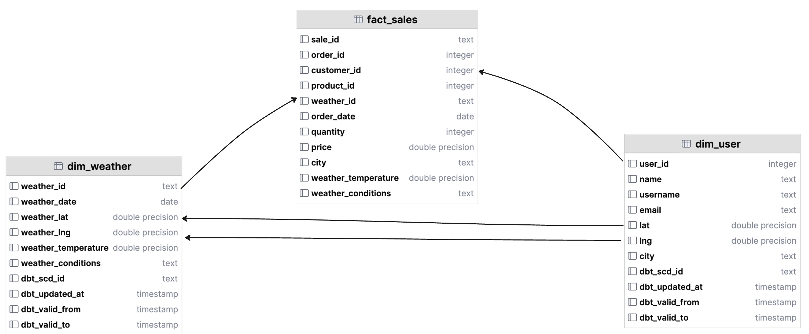
    </a>
  </h1>

  *This diagram shows the transformed star schema structure with `dim_user`, `dim_weather`, and `fact_sales` tables.*

  ### Data Quality
  Ensuring high data quality is paramount in our ELT pipeline to maintain the integrity of reports and analytics. To achieve this, we leverage `dbt tests` to systematically validate our data against several common data issues. Within dbt, there are four out-of-the-box tests that are particularly useful for maintaining data quality:

  - `not_null`: This test is used to ensure that specified columns do not contain any null values, which is crucial for fields that are expected to have data in every record.
  - `unique`: This test checks for uniqueness in a column’s values, preventing duplicate entries that could skew data analysis and reporting.
  - `accepted_values`: While we do not use this test in our current pipeline, it's worth mentioning that it allows for the specification of a set of acceptable values for a column, ensuring data conforms to expected criteria.
  - `relationships`: This test verifies referential integrity by ensuring that a column in one table correctly references corresponding values in another table.

  For our specific data quality needs in the `sales_pipeline`, we implement the `not_null`, `unique`, and `relationships` tests. These tests are essential for ensuring the following:

  - All sales, user, and weather records have complete information.
  - Each record is distinct and identifiable, maintaining the uniqueness of data points like sale ID or user ID.
  - There is referential integrity between our fact and dimension tables, which is crucial for the star schema to function correctly in joining data for analytics.

  The execution of these tests can be triggered through `dbt tests` commands or by using the data quality checks block within the `sales_pipeline`. By consistently applying these tests, we uphold the reliability and trustworthiness of our data, thereby empowering data-driven decision-making with confidence.

  These dbt tests are part of our automated data validation procedures that run as part of the pipeline's workflow. This proactive approach to data quality helps prevent the propagation of errors and ensures that any issues are identified and resolved promptly, maintaining the overall health of our data ecosystem.

### Data Documentation

  We use `dbt docs generate` to create an accessible documentation site that details our data models, enhancing understanding and navigation for the `sales_pipeline`. This interactive documentation allows for model searches, SQL code reviews, and insight into data structure through visual lineage charts. The process, which can be executed within our pipeline, results in transparent, collaborative, and well-governed data operations.

  To generate this documentation, you can execute the `dbt docs generate` command or run the create dbt documentation process within the `sales_pipeline`.

  Here is an example of what the dbt documentation looks like, providing a clear, organized view of our data models:

  <h1 align="center">
    <a
      target="_blank"
      href="http://localhost:8001/"
    >
      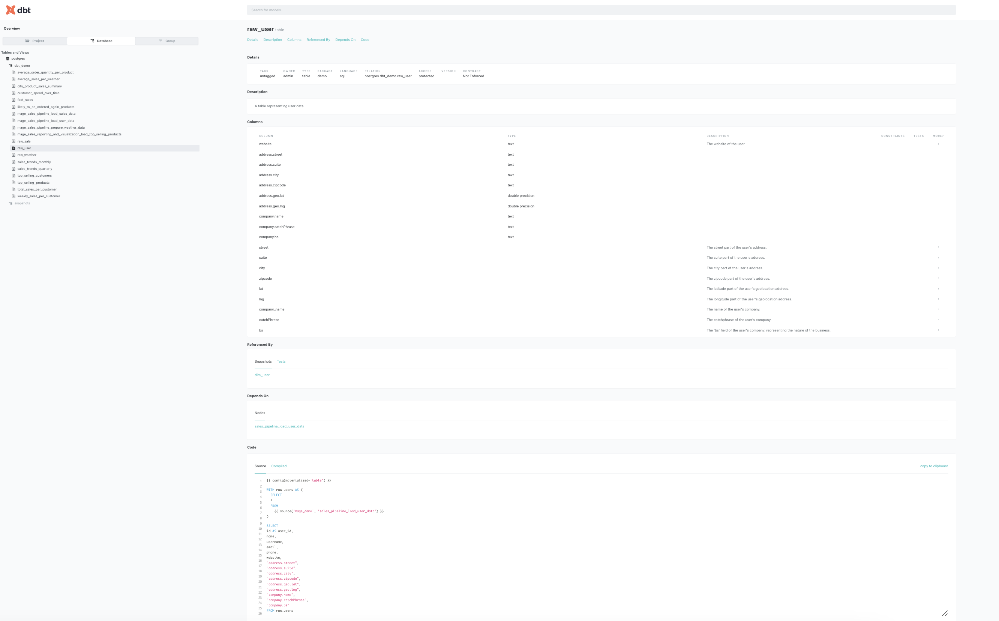
    </a>
  </h1>

## Conclusion
  The pipeline we've architected is highly scalable and adaptable, laying a solid groundwork for detailed sales and customer behavior analytics. Harnessing the power of MageAI for pipeline orchestration, visualization, and data integration from diverse sources, combined with DBT for SQL-based data transformation, has proven to be a formidable duo in accomplishing this project's objectives. This synergy enhances our data pipeline's capability, facilitating powerful and comprehensive analytics.
